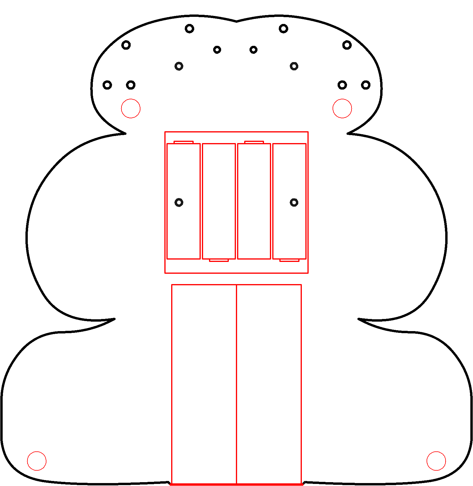

# Atoms

Stuff

----

<b>Materials</b>

Contents|Description| # |Data|Link|
:-------|:----------|:-:|:--:|:--:|
Periodic Table|01|Periodic Table business card|[-D-](1)|[-L-](card)|VK|Loose|40|60|0.5

----

## Topics

- Atoms
  - Sub-atomic particles
  - Electric charge
  - What's up with Hydrogen? (no neutrons)
  - What's up with Helium?
  - Orbitals and Valence
  - Fission and Fusion
- Chemistry (periodic table)
  - Bonds

----

## Goals

### Grey

1. Elements

### White

1. Chemistry

----

## NB3

This box will contribute the following (red) components to your NB3

----
