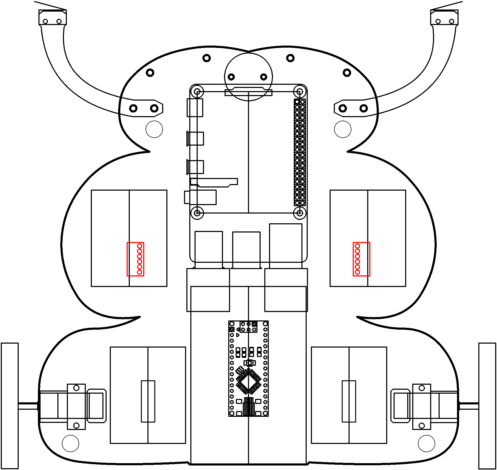

# Audio

Listen up, speak up.

----

<b>Materials</b>

Contents|Description| # |Data|Link|
:-------|:----------|:-:|:--:|:--:|
NB3 Ear|I2S mems microphone breakout board|2|[-D-](NB3_ear)|[-L-](VK)|Audio|20|20|20
NB3 Mouth|I2S DAC-AMP breakout board|1|[-D-](NB3_mouth)|[-L-](VK)|Audio|20|20|20
Speaker|3 Watt 4 Ohm with Dupont 2.54 mm socket|1|[-D-](_data/datasheets/CQR0508.jpg)|[-L-](https://www.amazon.co.uk/dp/B09JJ28D6R)|Loose|0|30|15
Speaker Mount|Custom laser cut mount for speaker|1|[-D-](-)|[-L-](VK)|Mounts|75|20|5
M3 standoff (15/PS)|15 mm long plug-to-socket M3 standoff|2|[-D-](-)|[-L-](https://uk.farnell.com/ettinger/05-13-151/spacer-m3x15-vzk/dp/1466726)|Hardware|5|5|15
M3 nut (square)|square M3 nut 1.8 mm thick|2|[-D-](-)|[-L-](https://www.accu.co.uk/flat-square-nuts/21326-HFSN-M3-A2)|Hardware|5|5|3
M3 bolt (6)|6 mm long M3 bolt|2|[-D-](-)|[-L-](https://www.accu.co.uk/pozi-pan-head-screws/500113-SPP-M3-6-ST-BZP)|Hardware|5|5|6
M2.5 bolt (6)|6 mm long M2.5 bolt|2|-|[-L-](https://www.accu.co.uk/pozi-pan-head-screws/9255-SPP-M2-5-6-A2)|Hardware|5|5|6
M2.5 nut|regular M2.5 nut|2|[-D-](-)|[-L-](https://www.accu.co.uk/hexagon-nuts/456430-HPN-M2-5-C8-Z)|Hardware|5|5|3

----

## Topics

- To Do

----

## Goals

### Grey

1. Setup your left/right MEMs microphones
2. Analyze sound in Python/C

### White

1. Sound (clap) localizer

----

## NB3

This box will contribute the following (red) components to your NB3

----
