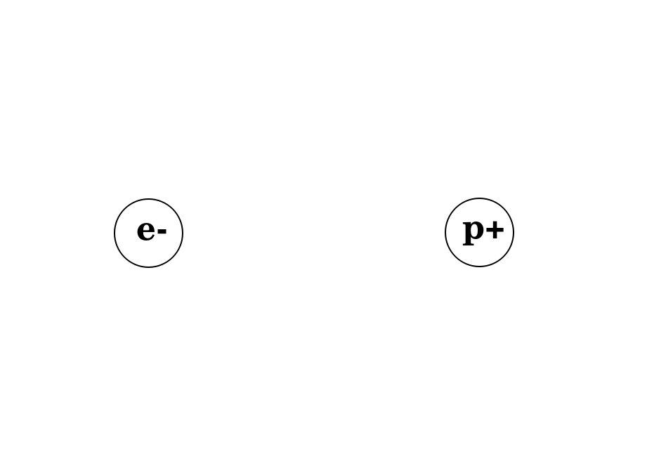

# Electrons

Electrons are sub-atomic particles with a negative electric charge. Their negative charge produces a *force* that attracts positive charges and repels negative charges.

In this box, we will learn about electricity...how to measure it and how to **control** it.

### Required Materials

- {01}: NBB-11, multimeter
- {10}: NBB-21, multimeter
- {11}: NBB-31, multimeter, oscilliscope

## Electric Fields

Electric fields describe the force a charged particle feels when near another charged particle.

{01}
Watch this video...closely.
- *Video*: [LBB:Electrons:Electric Fields](https://vimeo.com/625820421)

{10}
Watch this video.
- *Video*: [NB3:Electrons:Dipoles](https://vimeo.com/843622939)
  - **Task**: Draw the electric field around and electron and a proton seperated by some distance (as experienced by another electon). Use the following image as a starting point.*(draw_a_dipole_field:photo)*

## Voltage

Voltage describes the difference in charge in one location versus another.

{01}
- *Video*: [LBB:Electrons:Voltage](https://vimeo.com/625820421)

- *Video*: [LBB:Electrons:Batteries](https://vimeo.com/625820421)

- *Video*: [NB3:Electrons:Measuring Voltage](https://vimeo.com/843622939)
  - **Task**: Measure the voltage of a AA battery. Enter your measurement.*(number)*
  - **Task**: Measure the voltage of 4xAA batteries in series (i.e. in your holder). Enter your measurement.*(number)*

{10}
- *Video*: [NB3:Electrons:Household battery](https://vimeo.com/843622939)
  - **Task**: Build a battery. Upload a photo of your design and the voltage generated (as shown on the multimeter screen).*(photo)*

## Current

Electrons moving in a conductor (pushed by a voltage) create a current.

{01}
- *Video*: [LBB:Electrons:Current](https://vimeo.com/625820421)
  - **Task**: Measure the current flowing across a resitor.*(number)*

## Capacitors

Capacitors are cool.

{10}
- *Video*: [LBB:Electrons:Caps](https://vimeo.com/625820421)
- *Video*: [NB3:Electrons:Caps](https://vimeo.com/625820421)
  - **Task**: Measure the capacitance of your cap.*(number)*

