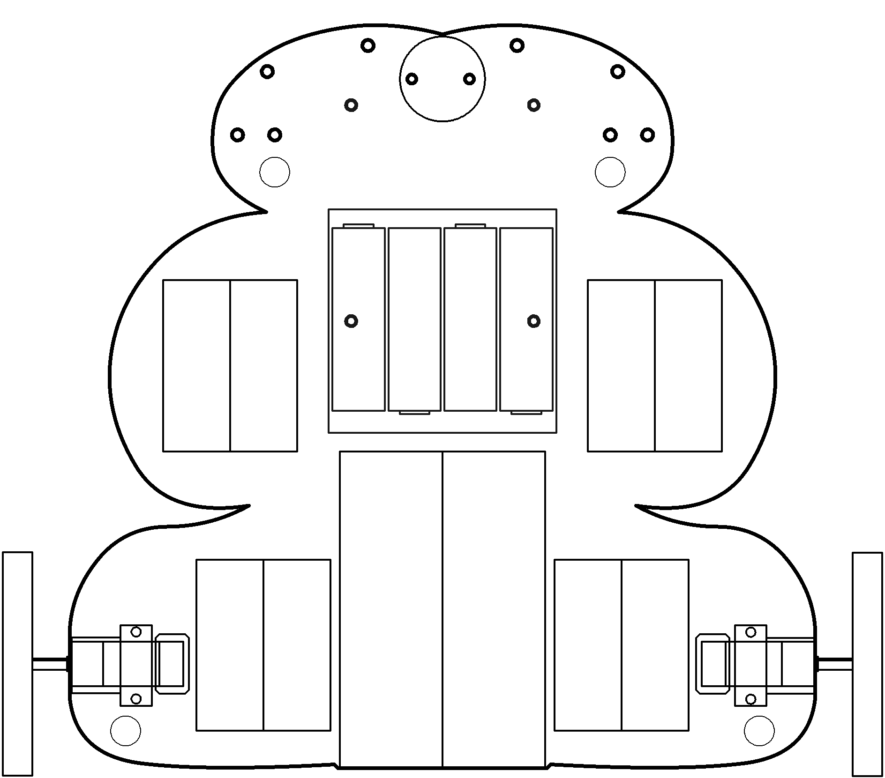

# Logic

Boole was cool.

----

<b>Materials</b>

Contents|Description| # |Data|Link|
:-------|:----------|:-:|:--:|:--:|
Gate (AND)|10|4xAND gate|[-D-](1)|[-L-](_data/datasheets/AND_gates.pdf)|https://uk.farnell.com/texas-instruments/cd4081be/ic-4000-cmos-4081-dip14-18v/dp/3120147|Active|10|20|8
Gate (OR)|10|4xOR gate|[-D-](1)|[-L-](_data/datasheets/OR_gates.pdf)|https://uk.farnell.com/texas-instruments/cd4072be/ic-gate/dp/3120138|Active|10|20|8
Gate (NOR)|10|4xNOR gate|[-D-](1)|[-L-](_data/datasheets/NOR_gates.pdf)|https://uk.farnell.com/texas-instruments/cd4001be/ic-nor-quad-4000-cmos-14dip/dp/3120100|Active|10|20|8
Gate (XOR)|10|4xXOR gate|[-D-](1)|[-L-](_data/datasheets/XOR_gates.pdf)|https://uk.farnell.com/texas-instruments/cd4070be/ic-4000-cmos-4070-dip14-18v/dp/3120134|Active|10|20|8

----

## Topics

- Logic (Boole is cool)
- Logic from MOSFETs: Not, AND, etc.
- Rules for simplifying and solving
- Math with Logic
- (Not open drain)

----

## Goals

### Grey

1. Test your AND, OR, XOR, and NOR gates using buttons and LEDs.
2. Turn 4-lvel comparator chain into 2-bit ADC.

### White

1. Build a 2-bit digital adder.

----

## NB3

This box will contribute the following (red) components to your NB3

----
