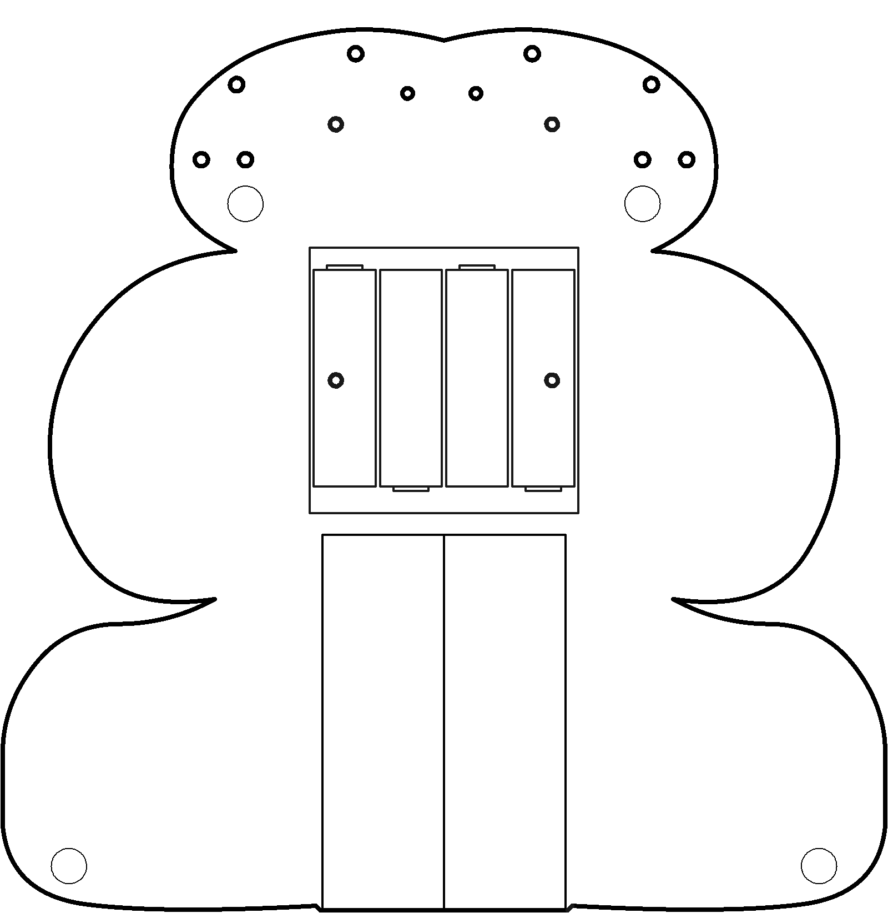

# Motors

Computers and brains work with voltages. In order for either to affect the environment, then voltage must converted into something that can act upon the world (light, sound, heat, motion, etc.). This conversion from voltage to action is called *actuation* and a thing that does it is an *actuator*. Given that we are building a robot, we will place particular emphasis on actuators that produce movement, ***motors***.

----

<b>Materials</b>

Contents|Description| # |Data|Link|
:-------|:----------|:-:|:--:|:--:|
DC Brushed Motor|01|6V Brushed DC motor|[-D-](1)|-|https://www.amazon.co.uk/Gikfun-1V-6V-Hobby-Arduino-EK1894/dp/B07BHHP2BT|Loose|20|40|15
DC Gearbox Motor|01|TT Gearbox DC Motor - 200RPM - 3 to 6VDC and wheel|[-D-](2)|-|https://www.adafruit.com/product/3777#technical-details|Loose|130|70|30
Motor Mount|01|Mount for TT Gearbox DC Motors - L-Bracket Type with hardware|[-D-](2)|-|https://www.adafruit.com/product/3768|Mounts|25|25|25
Servo Mount|01|Mount for servo motor|[-D-](2)|-|VK|Mounts|30|15|5
Servos|01|FS90R Micro Continuous Rotation Servo w/Wheel|[-D-](2)|-|https://www.rapidonline.com/feetech-fs90r-servo-and-wheel-37-1336|Loose|100|70|15
M2.5 bolt (6)|01|6 mm long M2.5 bolt|[-D-](8)|-|https://www.accu.co.uk/pozi-pan-head-screws/9255-SPP-M2-5-6-A2|Hardware|5|5|6
M2.5 standoff (12/SS)|01|12 mm long socket-to-socket M2.5 standoff|[-D-](4)|-|https://uk.farnell.com/wurth-elektronik/970120151/standoff-hex-female-female-12mm/dp/2884528|Hardware|5|5|12

----

## Topics

- Electromotive force
- Steppers
- Commutation (brushed vs brushless)
- Gears

----

## Goals

### Grey

1. Spin a motor, forwards and backwards
2. Regulate the motor's speed with a potentiometer and with a button (tactile switch)

### White

1. Light controlled motor...power?

----

## NB3

This box will contribute the following (red) components to your NB3

----
