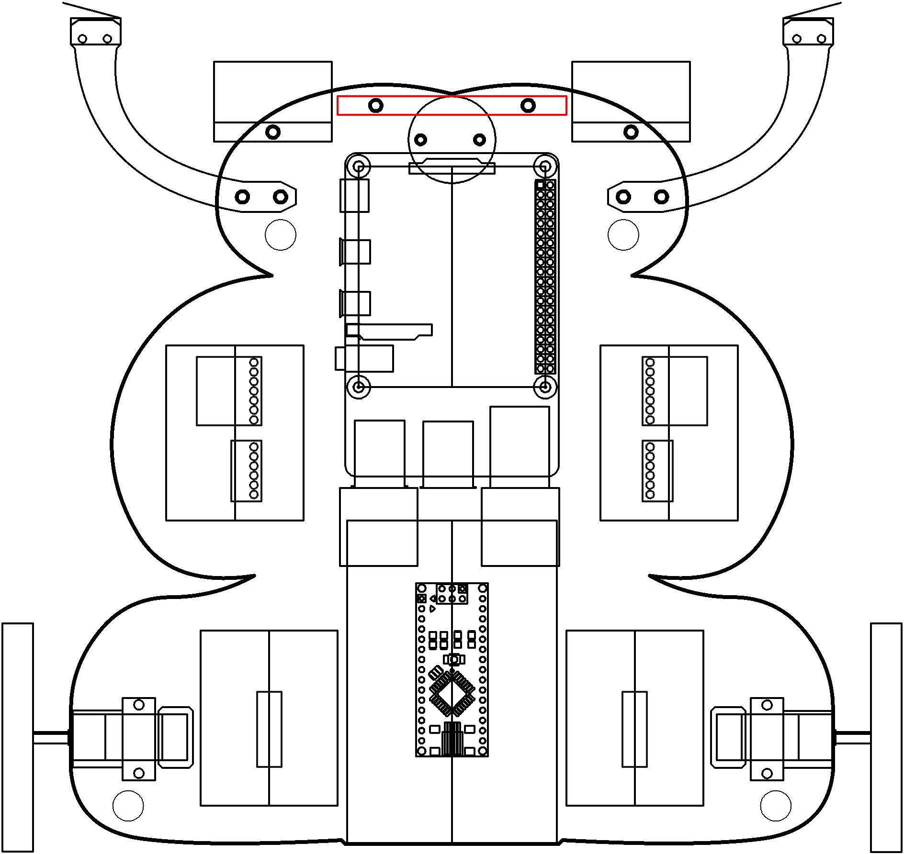

# Vision

Look at everyone.

----

<b>Materials</b>

Contents|Description| # |Data|Link|
:-------|:----------|:-:|:--:|:--:|
Camera (RPi v3)|01|RPi color camera with auto-focus (version 3)|[-D-](1)|[-L-](_data/datasheets/rpi_camera_v3.pdf)|https://uk.farnell.com/raspberry-pi/rpi-noir-camera-board/raspberry-pi-noir-camera-board/dp/2510729|Loose|120|75|23
NB3 Camera Mount|01|Custom laser cut mount for RPi camera|[-D-](1)|[-L-](NB3_camera_mount)|VK|Mounts|40|30|5
NB3 Cortex Mount|01|Custom laser cut holder for NPU|[-D-](1)|[-L-](NB3_cortex_mount)|VK|Mounts|75|65|5
M2.5 bolt (6)|01|6 mm long M2.5 bolt|[-D-](4)|-|https://www.accu.co.uk/pozi-pan-head-screws/9255-SPP-M2-5-6-A2|Hardware|5|5|6
M3 nut (square)|01|square M3 nut 1.8 mm thick|[-D-](1)|-|https://www.accu.co.uk/flat-square-nuts/21326-HFSN-M3-A2|Hardware|5|5|3
M3 bolt (12)|01|12 mm long M3 bolt|[-D-](1)|-|https://www.accu.co.uk/pozi-pan-head-screws/500116-SPP-M3-12-ST-BZP|Hardware|5|5|12
M2 bolt (8)|01|8 mm long M2 bolt|[-D-](4)|-|https://www.accu.co.uk/pozi-pan-head-screws/500101-SPP-M2-8-ST-BZP|Hardware|5|5|8
M2 nut|01|regular M2 nut|[-D-](4)|-|https://www.accu.co.uk/hexagon-nuts/456429-HPN-M2-C8-Z|Hardware|5|5|3

----

## Topics

- To Do

----

## Goals

### Grey

1. Setup and control your pan-tilt servo mount
2. Setup your Camera
3. Acquire images
4. Detect color blobs in image

### White

1. Stream images via webserver
2. Detect Face

----

## NB3

This box will contribute the following (red) components to your NB3

----
